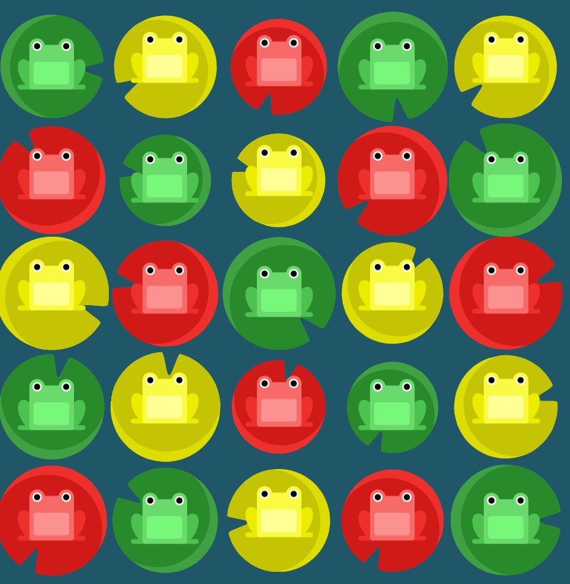
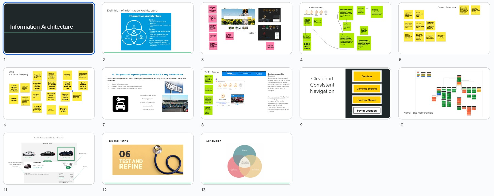

# 100 Days Of Code - Log
&nbsp;
### Day 1: March 1st 2023

Basing my journey on Freecodecamp and specifically the new Responsive web design as it is first on the list. https://www.freecodecamp.org/learn/2022/responsive-web-design 

**Today's Progress**: 
Tasks 1 - 14

I refreshed my knowledge on the following HTML basics:
Tags,elements, nested elements, images as SRC's, anchors and targets.

**Thoughts:** 

All of this was a refresh of elements covered in the SoC stage 2 tasks - I was surprised at how much I had forgotten.
This really brought it home to me that practice is so important and will hopefully make me perfect!

I really struggled with step 14 but I managed to figure it out and I guess I am going to feel like this a lot!

&nbsp;
### Day 2: March 2nd 2023

**Today's Progress**: 
Tasks 15 - 34

Carried out Freecodecamp ‘Responsive Web Design’ Tasks 15 - 34. Learnt about inserting links to a photo and how to improve accessibility of the image added with an alt attribute. Also tackled inserting sections, ordered and unordered lists, figure elements, figure captions and how to emphasize words with a strong element.

**Thoughts:** 

I was very 'cold' at the start and took a while to warm up and recall from task 14, how to insert image links. Practice, practice, practice!

&nbsp;
### Day 3: March 3rd 2023

**Today's Progress**: 
Tasks 35 - 46

Today I added a web form to collect information, actions, input elements, type and action attributes, radio buttons and id attributes.

**Thoughts:** 

Will this all stick??!!
Got tied up in knots over capitals and spaces!

&nbsp;
### Day 4: March 4th 2023

**Today's Progress**: 
Tasks 47 - 69 

It's Saturday so I decided to do two hours and complete the final steps of the "Learn HTML by Building a Cat Photo App". 
Hey - I am an expert!!!!!!!
No, no not at all. After focusing on forms for a few sessions, they threw in a request for an anchor element with a link and I thought...yes I know this but how do I construct that again? Yep it had slipped out of the backdoor of my brain. Got there in the end. Then they finished it off with some simple footers and essential title, doctype and meta elements.

**Thoughts:** 

I'm struck by how anxious I feel when asked to recall something I know I have done but have forgotten the precise structure of. So, thoughts like - where do I put that in the syntax. How much of this is memory and how much is it logic and where to look regarding having done something before.

&nbsp;
### Day 5: March 5th 2023

**Today's Progress**: 
Learn basic CSS by building a cafe menu
Tasks 1 - 20 

Today I covered inline styling, stylesheets and linking a stylesheet and experimented with alignment and background colours (I mean colors!)

**Thoughts:** 

It's Sunday funday! Finally moving on to coffee from cats and designing a coffee menu. Started off easy and then stumped by a couple of recap ideas from HTML stage.

Still making mistakes by using English spelling rather than american.
I LOVE the intro to CSS and find the commands a bit easier than HTML at this early stage of learning.

&nbsp;
### Day 6: March 6th 2023

**Today's Progress**: 
Learn basic CSS by building a cafe menu
Tasks 21 - 40 

Today I covered the CSS width (pixels and %'s) property, comments in CSS, class selectors, class attributes, background images, article elements, alignment, 

**Thoughts:** 

Still finding the intro to CSS commands a bit easier than HTML at this early stage of learning.

&nbsp;
### Day 7: March 7th 2023

**Today's Progress**: 
Continued with: Learn basic CSS by building a cafe menu
Tasks 41 - 60 

Today started by recapping text widths, then moved on to adding multiple class selectors, the padding properly, max-width property, font-family, fallback values for fonts and font styles

**Thoughts:** 

Still finding the intro to CSS commands a bit easier than HTML at this early stage of learning.

&nbsp;

### Day 8: March 8th 2023

**Today's Progress**: 
Continued with: Learn basic CSS by building a cafe menu
Tasks 61 - 82 

Introduced to \
 and changed line widths. Also beginning to understand when to use a "." (dot) and when not to use a "." when selecting elements / classes to style. Then covered the rainbow of colors for styling 

**Thoughts:** 

Found today the easiest day so far!

&nbsp;

 
### Day 9: March 9th 2023

**Today's Progress**: 
Finished Learn basic CSS by building a cafe menu
Tasks 83 - 91. This covered margin spaces, refresh of image links, spacing around images and negative margins.

Decided to spend an hour reviewing github basics and a further hour on basic command prompts.

**Thoughts:** 

I found it easier to learn when following freecodecamp lessons than 'just reading'.

&nbsp;
  
### Day 10: March 10th 2023

**Today's Progress**: 

Dived into the School of Code Stage 2 additional reading and in particular read https://bit.ly/2yoR5T8 This is part 1 of Understanding Git. 
A really helpful explanation.

Today I met up with fellow South Coast bootcampers and all were discussing JavaScript - of which I know nothing!
So I spent the second part of my session doing steps 1-10 (9%) of Basic Javascript. Covered comments, data types, variables, Storing Values with the Assignment Operator, Assigning the Value of One Variable to Another, Initializing Variables with the Assignment Operator, Declaring String Variables, Uninitialized Variables, Understanding Case Sensitivity in Variables, var and let differences and finally Declaring a Read-Only Variable with the const Keyword.

**Thoughts:** 

Cannot wait to do 8 hours or so a day of this!
I loved the intro to JavaScript!
  
&nbsp;

### Day 11: March 11th 2023

**Today's Progress**: 

Continued with Basic JavaScript, provided by FreeCodeCamp.
Covered:

Declare a Read-Only Variable with the const Keyword
Subtract One Number from Another
Multiply Two Numbers
Divide One Number by Another
Increment a Number
Decrement a Number
Create Decimal Numbers
Multiply Two Decimals
Divide one Decimal by Another
Finding a Remainder
Compound Assignment With Augmented Addition, Subtraction, Multiplication, Division, 
Escaping Literal Quotes in Strings 
Quoting Strings with Single Quotes 
Escape Sequences in Strings
  
**Thoughts:** 

Wow! All so easy until "Assign the following three lines of text into the single variable myStr using escape sequences"

FirstLine
\SecondLine
ThirdLine

Struggled to get to this:
/*const myStr = "FirstLine\n\t\\SecondLine\n\ThirdLine"; 

&nbsp;

### Day 12: March 12th 2023

**Today's Progress**: 

Continued with Basic JavaScript, provided by FreeCodeCamp.
Covered:

Concatenating Strings with Plus Operator
Concatenating Strings with the Plus Equals Operator
Constructing Strings with Variables
Appending Variables to Strings
Find the Length of a String

**Thoughts:** 

Shorter session today as I wanted to check that I have everything set up for fist day of School of Code tomorrow, in terms of running latest apps etc 

&nbsp;

Day 13: March 13th 2023
Today's Progress:

Long day today - I'm sure I'll get used to this. First day of SoC. Great intro - motivating and excellent introduction.
Wrote up my notes and decided to use my Hour of Code to finish the CSS Diner challenges at https://flukeout.github.io/
In the session today I progressed to level 15 in my pair programming session, so this evening I finished the remaining levels to 32.
I got the hang of it and really enjoyed it - great way to learn.
  
First Child Pseudo-selector
Only Child Pseudo-selector
Last Child Pseudo-selector
Nth Child Pseudo-selector
Nth Last Child Selector
First of Type Selector
Nth of Type Selector
Nth-of-type Selector with Formula
Only of Type Selector
Last of Type Selector
Empty Selector
Negation Pseudo-class
Attribute Selector
Attribute Value Selector
Attribute Starts With Selector
Attribute Ends With Selector
Attribute Wildcard Selector

Thoughts:

Seems that some of the descriptions above are more complicated than the actual commands.
One day at a time and take on board all the good advice given today about the method of learning and the truth about being well outside of my comfort zone!

&nbsp;
### Day 14: March 14th 2023
**Today's Progress:**

This felt like another long day today. Second day of SoC. 
We covered more computational thinking, reflective learning, and self-management. All okay I thought and then we tried to solve a scratch challenge.
It was difficult to remember how to solve a simple game based on a user guessing if the next number generated will be more or less than the previous number. There were to be 5 rounds, and the users score would increase or decrease based on whether they guessed correctly or not. My coding team (Lawrence and Lucy) had a good stab but we couldn't quite get there with the loop.

Then this was followed by revisiting Git! If you are reading this then I managed to clone my repository, make changes, and push them back up, rather than simply editing the readme file online!!!!! :grin:

With Git, we looked at the rhythm of changes from starting a new project, making changes (as a team) and pushing / pulling them back down.
I do need much more practice as I am unsure of how branches work and lots of other things. In fact, at this stage I do not even know what I do not know.
I'm pleased if this appears online though :blush:

Tom Burns stayed online after class finished and pointed me in the direction of helpful resources - star! :star2:

Other resources and tools which were new to me today are:
Google Jamboard and Diagrams.net

For the remaining 30 mins of my time, I recapped basic JavaScript functions to help me first thing tomorrow as I believe that is how the day starts - after the squats! :smiley:

**Thoughts:**

Still taking this one day at a time. Hardest thing right now is to not feel overwhelmed and just keep practicing.
Read this online and found mistakes - so had to prove to myself I could amend and upload again - If I can see this line, I did it! :two_hearts:

&nbsp;
### Day 15: March 14th 2023
**Today's Progress:**

It was explained to us why we will be focusing on Javascript (as opposed to other possible languages) - whilst it was written in 10 days, it is the current leading language for Web.

Today we covered:
The 5 pillars of learning good JS and how to learn by REPL.

Our main task was to use our newfound JavaScript knowledge to make a secret only available to people who knew the correct password.

We used:

variables, if statements, loops, functions

Then, we declared a function that prompts the user for input - a password. 
We stored that password in a variable within the function
Checked whether the password matched the correct password 
If it did, returned a true from the function.
If it didn't, let them try again.
If they failed three times in a row, it returned a false from the function.

Then:

👉 We Refactored the code into a function called an authenticateUser. This returned a true if the user logged in successfully with the correct password and false if they got the password wrong more than three times. 

I got there in the end (Google was my friend) and I don't know if i could do it again without practising many many times.

I tried to push all my changes to Git Hub - I couldn't see that this worked, but my Visual Code said it worked and my code buddy said he could see the changes. At the moment I am like a rabbit in the headlights with Git.

Other resources and tools which were new to me today are:
https://30secondsofknowledge.com/ - wow - what a cool tool! I've installed this and set it to JS.

**Thoughts:**

HELP!

At the risk of repeating myself. This felt like another (very) long day. Third day of SoC. 

I seem to have moments of eureka, followed by despair.

I've worked out how to add a spell checker extension here, added it and (hopefully) removed my mistakes!
Will I be able to push these changes to GitHub? Let's find out! :grin: AGAIN!

&nbsp;
### Day 16: March 16th 2023
**Today's Progress:**

We were introduced to objects and arrays. We then had an excellent presentation by Joseph Trodden where we focused on the purpose of feedback how to give and receive good feedback and this was very engaging along the emphasis once again that working in teams is critical for success in the workplace.

We covered casing, Let, Const and Var.

We set files up (HTML and JS) and linked them in VSC.

We looked at how to create arrays, select from an array, ask the console about the length of an array, remove the last element.

👉 Other resources and tools which were new to me today are:

My programming teammate introduced me to more keyboard shortcuts and how to edit multiple lines in VSC. 

I had my first session with my mentor. I have never had a mentor before. It was brilliant – I really appreciated being able to ask stupid questions!

**Thoughts:**

We started with a quiz!!!! I was not expecting that and managed 5/8. 
More revision / practice needed, but I knew that yesterday was a confusing day for me. 
They really meant it when they said thrive outside of your comfort zone! 
I really need to accelerate the feeling of being comfortable with not knowing everything. 
It also feels incredibly strange to be permitted to Google the answer.

&nbsp;

### Day 17: March 17th 2023
**Today's Progress:**

It started with a :kiss: I mean quiz, to check learning so far - I definitely have some knowledge gaps. After a re-cap of topics covered this week we dived into my first hackathon. This week, we had to use JavaScript to create a Rock, Paper, Scissors game.

We mastered git (only kidding). We progressed our understanding of Git and managed to send commits up and down and we also managed a fair number of the required tasks. I have weekend homework and I'm looking forward to cementing some concepts over the weekend.

👉 Other resources and tools which were new to me today are: 

My coding partner showed me how to preview this log before pushing changes and noticing errors after the event. 

**Thoughts:**

Today I discovered that sometimes Chat GPT can mess up and send you answers to a question you did not ask. I'd like to say we are only human but ....

&nbsp;

### Day 18: March 18th 2023
**Today's Progress:**

Today I spent the day reviewing the entire weeks teachings from School of Code and testing myself at the console.

I re-capped the following: 

Computational thinking
Declaring and assigning variables
Using variables
Types
Primitive types (strings, numbers, booleans)
Arrays and objects
Functions
How to declare a function (with parameters)
How to call a function (with arguments)
How to use a function’s return value (if there is one)
Loops
While
For
If statements
Operators (+, -, *, /, =, %, etc.)

I then tested myself by continuing with freeCodeCamp's Basic Javascript course. 

👉 I found and like the format of https://htmlcheatsheet.com/js/ 

**Thoughts:**

I still need need to practice writing javascript. Practice definitely moves me further towards being better!

&nbsp;

### Day 19: March 19th 2023
**Today's Progress:**

This am, I met up with 5 fellow School of Code students (Michael, Tom, Ahia, Vicky and Christian), for a couple of hours to recap on some fundamentals (JS arrays, Functions and Loops).

I then progressed through 30 or so further freeBootCamp JS questions (until I reached an area not yet covered by SoC, "Selecting from many options with Switch Statements"). 
Finally, I completed the W3Schools JS Quiz Test for a change. I scored 80% which is much better that the tests with SoC this week and considering I haven't covered some of the areas yet I was pleased with this progress.

 and then revisited the code written for the hackathon to solve the Rock, Paper, Scissors challenge.

**Thoughts:**

I feel like I can read and understand certain lines of code, but when it comes to writing it, I often confuse syntax - particularly with regards to the choice of bracket types. 

I hope that week 2 of SoC cements some of these concepts. :sweat_smile:

&nbsp;
### Day 20: March 20th 2023
**Today's Progress:**

Today, the SoC introduced us to the DOM!
I never appreciated that when a web page is loaded, the browser creates a Document Object Model of the page!

This is totally new - I thought that the JS simply worked alongside the HTML and CSS pages and the DOM, with JS gets all the power it needs to create dynamic HTML.

We worked in a team of 3 (with Hani and James) and practiced:

How to change the content of HTML elements
How to change the style (CSS) of HTML elements
How to react to HTML DOM events
How to add and delete HTML elements

We changed some elements to get a penny doubling scheme up and running, ready to create some riches. 💰💸
Here is the link - https://t-racey.github.io/SoC-Wk2-Penny-Doubling-Pyramid-Scheme/

I also (finally) completed a CodeWar challenge - better get cracking with these as there will be a SoC leaderboard soon!

I spent my official #100DaysofCode extra hour:hourglass: testing myself on what I have learned today about DOM and I also completed another CodeWar challenge (just the one!).

**Thoughts:**

It was great to see a page respond to a DOM event! :tada:

However, I was alarmed that I had managed to so easily forget CSS and HTML from a few months ago. Quickly picked it up again though. :high_brightness:

&nbsp;
### Day 21: March 21st 2023
**Today's Progress:**

I kicked the day off before class with a couple of CodeWar challenges - I could complete a couple of the easier questions and I'm obviously a keen beaver! I then moved on to a 'Wolf in Sheep's Clothing' with my team and I struggled with this. The highs and lows of this journey! I'm sure I'll get it next time.

We then had a talk from a previous Bootcamper Piper Bates who is now successfully employed as a Software Engineer. She gave us a great insight into her journey and the importance of networking and building a strong network of contacts.

We were then introduced to Event Listeners and we experimented with various events and how to use them to change the DOM.

We were told that this is our plaYground and we can do whatever we want with it. We had fun playing with colours, fonts and sizes.

We then revisited our Rock, Paper, Scissors game and we were encouraged to work with Github CoPilot to help us with our code. I was impressed with the suggestions it made and I'm looking forward to using it more. We were also encouraged to explore Chat GPT and I was impressed with the suggestions it made when it was working, but I think we overloaded it with multiple requests and it stopped working. 

I'm frustrated that I  can't produce every aspect of the game that I want and that i can't make it look pretty although I'm sure that will come with time and practice. 

I hope that I look back at this in a couple of weeks and appreciate how far I have come.

**Thoughts:**

It was great to work with the team today cloning, pushing and pulling our work thrugh Github. I'm looking forward to using this more.

&nbsp;

### Day 22: March 22nd 2023
**Today's Progress:**

Today we completed the Myers Briggs Personality Test, I have completed this before. We will be working with this tomorrow in a session on Mindset learning.

We were then introduced to asynchronous JavaScript and the concept of callbacks. This was followed by the concept of promises and the concept of async/await.
We looked at setTimeout and setInterval.

We practiced this by moving the hands on a clock and we also practiced using the console to test our code.

Here is a link to this https://t-racey.github.io/SoC-Wk2-A-ticking-Clock/

Next - API's and how to interact with other organization's data. We used 'Fetch' to get data from an API that served up interesting facts about cats. 
We met JSON - a data format that is used to store and transport data. It is often used when data is sent from a server to a web page.       
And I was introduced to parsing JSON - converting JSON into a JavaScript object.

We practiced this with a cat API which produced a random fact about cats.
Here is a link - https://t-racey.github.io/SoC-Wk2-Cat-Fact-Generator/

**Thoughts:**
Overwhelmed by the amount of information we were given today. I'm looking forward to the next few days to consolidate this learning.

&nbsp;

### Day 23: March 23rd 2023
**Today's Progress:**

I started work early today, preparing for my Mentor meeting tomorrow. And then, for my extra hour of code I revisited basic HTML on Udacity - a free course and specifically HTML Syntax Problem Set. 

We started the day with a quiz about Asynch and Fetch.
My first quiz where I scored 100%. Not because I understand it but because there were less specifics and I am good at the bigger picture.

We then completed a Codewar challenge. I am still finding level 8 incredibly tough and beginning to accept that it is completely fine to research different types of functions to solve a problem. I am not expected to know all the functions at this early stage of School of Code. I tackled the "Return Negative" challenge. I came across a new maths Operator - the Math.abs.

We then had a talk by Joseph on Cognitive Diversity - Apparently I am a charismatic and inspiring leader!
Thinkers feel and feelers feel!

This was followed by a talk from Paavan who is an expert in UX design and also a magician - really fascinating talk about the 'hows and whys' to improve UX experiences. A great resource that was suggested was "Refactoring UI - Practical Principles for UI design".

Then we had a team research challenge where I worked with Jay, Jo, Safiyah, James and Hani. 

Instructions: The aim is for you to spend time researching your topic (Javascript Loops) and create a short (approx. 5min) video to teach your fellow bootcampers, Each team member should have a speaking part.

We divided the research task up and used Google Docs to prepare our presentation. We each had a loop to research. We defined it, showed the code and gave a real-life example. 

Our biggest challenge was recording the presentation with 6 participants and uploading the file within the time allowed. This was a really fun and engaging challenge! 

My Loop was the 'For In' loop. It is used to iterate over the properties of an object. It loops through all enumerable properties of an object, including those inherited from the prototype chain. 

My real case example was "Imagine you have an object with the names of your favourite fruits and their corresponding colours. You can use a for...in loop to print out the name and colour of each fruit".

I then popped into a Kumospace event where coach Hamza shared a couple of really useful youtube links which will hopefully help me with my approach to learning code.

**Thoughts:**.

A great day . I feel like I moved forward a little today.

&nbsp;

### Day 24: March 24th 2023
**Today's Progress:**

I started work early again today. I find that getting an hour of coding in at the start of the day helps to make me feel more productive and I am more likely to get more done.

No starter quiz today. Whoop! :tada:
But still, we had to do the infamous School  of Code "squats", :sweat:

We then went straight into our Hackathon challenge. We were given the day to select an API and create a project using it. We were given a list of APIs to choose from and my team (Hani and James) chose the 'The Open Trivia Database API'.

We spent the day researching the API and planning our project. We decided to create a quiz game. We used the API to get the questions and answers and we used the DOM to display the questions and answers. We used the console to test our code and we used Github to collaborate and push our code.

Here is a link to our project - https://t-racey.github.io/SoC-Wk2-Trivial-Knowledge-Quiz/

Coach Kazeem said we did well so I'm taking that and running with it! :runner:

I also had a meeting with my mentor today. We discussed my progress I specifically asked about how to approach level 8 Codewar challenges. I realised that it is indeed acceptable to search for tips on how to solve the challenge and Hannah worked with me in breaking down the challenge into smaller steps.

**Thoughts:**.

A strong end to the week! Just as well, I'm shattered! :sleeping:

Apparently we have a couple of hours homework and class starts at 11am on Monday so more time to practice my coding before we get going on new learning.

I'm looking forward to a bit of a break from the keyboard and will be keen to consolidate my learning a bit more.

&nbsp;

### Day 25: March 25th 2023
**Today's Progress:**

Today, being a Saturday was a catching up on life kind of day. 
I wondered if I would squeeze some coding practice in and I managed to just get my hour in before midnight!

I continued with my Udacity course on HTML and completed the HTML Syntax Problem Set. I also completed the HTML Syntax Quiz.
I then completed a couple of level 8 Codewar challenges. Another Sum of Positives challenge and how to add two arrays together.

**Thoughts:**.

Looking forward to a morning of revision tomorrow.

&nbsp;
### Day 26: March 26th 2023
**Today's Progress:**

Today I completed four recap tasks provided by the School of Code which included:

Task 1 - Playing around with arrays 👆  
Task 2 - Setting a counter that increase by 1 second and stopped when it reached 12 🔄  
Task 3 - Creating a cat fact and random photo generator by practicing playing with an API - https://t-racey.github.io/Cat-Photo-and-Facts/ 🐈  
Task 4 - Creating a very basic to do list, adding a priority and then shuffling the order of the tasks based on priority🔺  

A great day recapping the knowledge I have gained so far.

&nbsp;

### Day 27: March 27th 2023
**Today's Progress:**

Started at 11! Whoop!

As I had completed my recap tasks over the weekend, this meant a special gift of time to practice practice practice. I completed Udacity’s introduction course UD001 (Basic HTML and CSS). I then started the Udacity Javascript introductory course. I really loved having the extra time to practice at my personal most productive time is early am 06.30am – 11:00am.

We then did our squats and had a quick quiz to check our understanding of last weeks learning. We had a great talk from Dave Adams who is an expert in SRE (Site Reliability Engineer). 

We gave feedback on our code trio, both positive and negative and then met our new trio. Nice to meet Catherine and Saynab.

We then tried some blind coding to replicate a google page! Fortunately, this wasn’t awful as I have recently been revising CSS and managed to produce a word, centralised on the page 😊

This afternoon, we were introduced to Agile and the Atlassian website as a good example resource and the https://agilemanifesto.org/principles.html

We looked at the differences between UI and UX and were introduced to Flexbox and CSS grid with the help of two games. 

(1) flexboxfroggy.com  

(2) https://cssgridgarden.com/

(2) https://cssgridgarden.com/  

For my #100daysofcode I completed 35% of a new module with Udacity on Javascript, as I feel that I want to practice so much of what I have learnt over the last two weeks.  

&nbsp;
### Day 28: March 28th 2023
**Today's Progress:**

Today we zoomed into UX with a fun morning with the #SchoolofCode. We used Hasso design thinking to think about a School of Hiking Bootcamp.  

Our Disney trio:

Dreamers wanted a VR app,   
Realists said no budget,   
Critics said too complicated.

Fun going through the steps...laughed a lot.

Our afternoon was spent on the UX of the School of Hiking website. We were given a list of tasks to complete and we worked as a trio to complete them.

Finally, we looked at the website https://cantunsee.space
   - select the design that is most correct you say! 😕
   - Well, let me tell you, it's not child's play. 🧸
   - For every button, every font, 🖱️
   - Could mean the difference between an "A" 🙋‍♀️and "uh oh, don't"🙀

For my hour of code I practiced the Udacity Conditionals quizzes:

  - Checking your balance
  - Ice-cream quiz, and a
  - Clothes size quiz

And completed three Codewar challenges taking my kyu score to a heady 58 😎 💅

  &nbsp;
### Day 29: March 29th 2023
**Today's Progress:**

Today we continued with our introduction to UI and UX. We touched on design theory and were told that we do not have to have an art degree to be a good designer. We were given a list of design principles to consider and were introduced to various tools which can be used to help with the design process. For example, Figma for wireframing and prototyping and low fidelity wireframes. We were also introduced to useful accessibility tools such as Lighthouse and WebAIM.

We then moved on to CSS variables - a way to store values in CSS and then use them in our code. We looked at how to organise CSS code and the CSS priority order. 

We were given the task of cloning a popular website and I attempted to clone Google. I was able to get the header and footer to look similar but I struggled with other content floating around the page - as you will see below! I will need to continue to work on this over the weekend.

For my additional hour of personal coding, I covered some advanced conditionals in Javascript, such as Truthy and Falsy values and the ternary operator. I also completed a couple of Codewar challenge.

 &nbsp;
### Day 30: March 30th 2023
**Today's Progress:**

We started the day as usual with a few **Codewar challenges** - the team were on fire this am and we managed to successfully solve four without too much difficulty. It is amazing how much you can learn in a week! 

We then recapped the material covered on the 29th with a **quiz**.

We moved on to the next **mindset** subject with Joseph. We covered perspectives for Ideation, both positional and generative. We looked at a couple of tools - the PNI (Positive, Negative and Interesting) and the LAER (Listen, Ask, Explore, Reflect) model. We covered Deep Listening and whether we are really listening to each other! We were asked to identify what type (4) of listener we are (Lost, Interrupting, Shrewd or Dramatic) and most concluded we are a bit of all of them at different times!

We then had a fascinating and engaging **talk from two excellent speakers from Nester**. The talk was primarily about UX/UI but the CTO Javaid Karim talked about his goal to recruit junior developers and creating a supportive environment. Alex Fairholm shared his portfolio and both were extremely open about what helps them to be successful in their roles and also what we should be doing to prepare for our future careers. In particular with portfolios, we should share our working and not just a finished project. When we finish our final project don't be afraid to share where we think we could have improved.

**Helpful tools shared:**

  -  Dizzy Designs, Pegasus, Figma, Untitled UI, Responsive Viewer (a chrome extension), Bootstrap

**Helpful tips shared:**

  - Build your website in React.
Use a couple of libraries - so for example if designing a form - use a library for the form and then add your own styling.

For the afternoon we were given a research task. Our subject was Information Architecture. We were tasked with researching and explaining the subject with reference to car hire web sites. We used a Jam board to share our findings and then used this to help us prepare a google slideshow. I cannot believe that in the space of 90 mins we researched the topic, created slides, recorded a presentation and uploaded all to YouTube! I am so proud of our team of 6 and the effort we put in. 

For my hour of code I revised while loops, for loops and nested loops by tackling new material from Udacity. 

I then prepared for my mentor meeting tomorrow. A great day.

&nbsp;
### Day 31: March 31st 2023
**Today's Progress:**  

I can hardly believe that this is day 31 of 100 days of code! Almost a third of the way there. I have learnt so much in the last month and I am so grateful to the School of Code for giving me this opportunity.  

Friday is hackathon day and it was great to see what we could achieve in 8 hours. I was looking forward to working with my new team and creating something that built on all of the teaching this week about UX/UI.

We reviewed our user stories and user personas from earlier in the week to reorient ourselves with our users' needs and the problem we're solving. (A Hikers Bootcamp).

We reviewed our users journey flow diagram on Figma. We inserted this in a google presentation and then shared it with the team. We then used this to create a low fidelity wireframe. 

We then used this to create a high fidelity wireframe on a Figma plugin (Webflow). 

We chose a Color scheme using Cooler and scored 95% on Lighthouse helping the site to be distinguishable for people who are color-blind. The scheme provided good contrast.

The computational thinking before we started the website construction really helped us to break it down and design decisions were so much easier as a result. This practical task really helped to solidify our learning on what is a very new subject for us.

Here is a link to our site - https://t-racey.github.io/SoC-Wk3-Hackathon-Landing-Page/ - we received some positive and encouraging feedback from our coach and we are really proud of what we achieved in 8 hours.

For my hour of personal coding, I enjoyed progressing through a MIMO lesson on HTML Basics - I am really enjoying the MIMO lessons and quiz Q  and A I am looking forward to completing the rest of this course over the weekend.

  

&nbsp;
### Day 32: April 1st 2023
**Today's Progress:**  

During the week, we were introduced to the Figma app and we were tasked with creating a low fidelity wireframe for our hackathon project. My team member got to grips with the tool very quickly but I felt that I needed to do this first hand to really understand how it works. 

Watched and worked alongside a two hour video from Udemy about how to design a website and dashboard from scratch in Figma. I really enjoyed this and it was great to see how a professional designer works. I am looking forward to putting this into practice over the weekend when I start my homework task.

I created the following page (based on the tutorial) and experimented with various duplicated pages so that I could play with the prototype animation/presentation options .

I also progressed with a highly addictive MIMO course, revising CSS Basics. I feel that it is important to keep up with the basics and to keep practicing. I then learnt how to clean up the files to get them ready for development.

This is not an April Fools...

&nbsp;
### Day 33: April 2nd 2023
**Today's Progress:**  

I am going to let my tweet speak for me today.  

Day 33 #100DaysofCode Epic day, applying UX/UI design process to myself!  Great way to learn about user personas, user stories, low fi, sketches, wireframing & initial mock ups for my own site. Lots more to do but have loved this task 🤓❤️Thank you 
@theSchoolOfCode   #getoutmore

Find out more here! https://github.com/SchoolOfCode/bc14_w3_recap-task-T-racey 

Really pleased with progress made this weekend.

&nbsp;
### Day 34: April 3rd 2023
**Today's Progress:**  

Week 4 of The School of Code has started and we are now learning about Testing. Time to say goodbye to Catherine and Saynab and say hello to my new coding partner - Farhiyo.

We started with feedback to/from our partners last week and then had a fantastic talk from Talis (Nadeem Shabir and Elly Durrant) about testing. We learnt about the different types of testing (Unit, Integration, System, UI, and Manual). We heard what it is like to be a tester and the skills that are needed. We also heard about the tension between 'software makers' and 'software breakers'. 

Nadeem was very open about what he looks for in a junior developer and what he thinks we should be doing to prepare for our future careers. He was clear that team work is *key* and that we should be working on our soft skills as well as our technical skills. A quote I loved was that, a mistake that junior developers make is that they try to 'boil the ocean'! "Just solve the problem in front of you and then move on to the next problem".

After lunch we were introduced to node js and npm. We were tasked with a practical assignment which we worked through in our pair. 

This involved:

  -  Installing node js and npm
  -  Creating a new project
  -  Installing a package
  -  Running a script

I really enjoyed this and I am looking forward to learning more about testing in the coming weeks.

I finished my day progressing with MIMO I reviewed Javascript basics and am now working through HTML Intermediate. I am finding this constant review of the basics helpful and I am enjoying the MIMO lessons.

&nbsp;
### Day 35: April 4th 2023
**Today's Progress:** 

Today was testing! Literally - we arranged, acted and asserted in the Node JS environment. We learnt about the different types of testing (Unit, Integration, UI). We used Jest and had a go at writing our own tests. We had to work out what function was needed to make the test pass. We then had to try and make the tests fail.

I was stuck for absolutely ages and a colleague suggested reinstalling Jest. I did this and it worked! I was so pleased with the gree passes. 

Internet troubles today made for a challenging day with zoom. I am looking forward to getting back to normal tomorrow.

&nbsp;
### Day 36: April 5th 2023
**Today's Progress:** 

Today was exceptionally frustrating. Testing is testing me and at points I felt like I was completely losing the plot. I am not sure if it is the subject matter or the fact that I am tired but I am finding it hard to concentrate and I am struggling to get my head around the details. 

We were introduced to Integrated testing and in particular Playright. We were tasked with writing tests to check a to do list app.

I am going to keep going and I am going to keep trying. I am going to keep learning. I am going to keep coding!

Me and my coding partner spent two hours today on a missing {} error. We tried everything and nothing worked. We then had to ask for help. A coach took 30 seconds to pinpoint our mistake. ☠️

After an hours exercise, I came back to it and added a couple of other tests. These worked, but I always need a shove in the right direction. 

The frustration is that I can understand the principles but the details are eluding me. 

I am dreading the hackathon tomorrow!  
 &nbsp;
### Day 37: April 6th 2023
**Today's Progress:** 

The day started positively with an excellent talk from Patrick about the Inner Critic and Building Resistance. I really enjoyed this and I am no doubt a Pusher and a Perfectionist. I am going to work on my inner critic and I am going to try and be kinder to myself.

This was followed by a great talk from Dani Markovits and Patrick Shea-Stamford about Linked-In and new features since I last used it. As a result, I have updated my profile and connected with some more SoC colleagues.

I then had a meeting with my mentor who gave me some fantastic resource links about Testing, following my difficult day yesterday. I am going to spend some time this weekend reading these and I am going to try and get my head around the details.

I then joined my coding buddy Farhiyo for a testing hackathon, which was, well, testing (again). The idea was that we were supposed to be writing tests for a to do list app - again. We struggled at the basic set up of the run time environment.

However, I have spent a further three hours reviewing other colleagues work and created a brand new branch off of our repo with a working set of tests for the to do list app. I am really pleased with this and I am looking forward to the testing re-cap homework this weekend - yes, honestly!

 &nbsp;
### Day 38: April 7th 2023
**Today's Progress:** 

Good Friday! Not a day off. But no School of Code daily squats either!

Started with a progress interview with the very lovely Callum. Somebody else's turn to experience interrupted wifi - three attempts to complete the interview and we finally got there. It was illuminating and has given me much to think about.

I then started task 1 of my weekend homework and completed writing my own cycling themed codewar challenge. I have written the code and challenge notes and I am now ready to begin working on the testing with Jest. I am really enjoying this and I am looking forward to completing the challenge and submitting it.

I then spent a couple of hours on my Web Development course with MIMO. I am 19% of the way through and completed CSS INtermediate and Types and Comparisons. I really need this revision of what I have covered with the SoC a couple of weeks ago which would otherwise fall out of the back of my head!

 Hey I was position number 1 on the wooden spoon leaderboard at close of play yesterday, meaning that I have been promoted to the stone lead! 🤣

 &nbsp;
### Day 39: April 8th 2023
**Today's Progress:** 

I completed my codewar challenge and submitted it!

I revised the basics of testing with Jest and constructed 6 tests for my challenge. I then wrote the code to make the tests pass. I am really pleased with this due to the relative lack of success with this last week. I cannot believe how great it feels when the tests pass!

I then spent an hour revising Accessibility and ARIA with MIMO. 

## You are a coach 🚲 for a professional🏆 bicycle racing team, 
and you need to analyse the results of the team's recent time trial. 
The time trial consisted of a single stage, and for each rider on the team, 
you have recorded the time that they took to complete the stage.
Write a function calculateAverageTime(results) that takes an array results as input, 
where results[i] represents the time (in minutes) that rider i took to complete the 
stage. Your function should calculate the average time taken by all riders and return 
it as a string with two decimal places.

For example, if the input results array is:

[20, 22, 24, 26, 28]

This represents a time trial with 5 riders on the team. Rider 1 
completed the stage in 20 minutes, rider 2 in 22 minutes, and so on. 

Assume that the number of riders on the team is between 1 and 10, 
and that the times are all positive integers.

👉//write your code here.
  function calculateAverageTime(arr) {
{

//Your function should calculate the average time taken by all riders and be returned as a string with two decimal places:
"24.00"🕔

TESTS

// Test to verify if the function correctly calculates the average time for a given input array

// Test to verify if the function returns 0 when the input array is empty

 // Test to verify if the function returns the only element of the input array when it contains only one element

// Test to verify if the function throws an error when the input is not an array

// Test to verify if the function throws an error when the input array contains non-numeric values

 // Test to verify if the function throws an error when the input array contains more than 10 elements

&nbsp;
### Day 40: April 9th 2023
**Today's Progress:** 

Happy Easter Sunday! I spent the morning with my family and then spent the afternoon revising the basics of testing with Playwright. I then completed the final testing task homework for the week. I wrote Playwright tests for a simple tweet app, covering user flows for creating and displaying tweets. 

I then completed two hours revision with Mimo, on CSS Layout and JS Conditionals 👩‍💻Happy Easter everyone 🐰🍫

&nbsp;
### Day 41: April 10th 2023
**Today's Progress:** 

Today was a prepare for React day.  

This feels like a big step up, based on nothing, as recall I had not written a line of code 4 weeks ago. However, most coders I have spoken to spend a lot of time with React and so I am grateful for the four day weekend to get my head around it. It has been great finishing the 'testing' homework AND having time to read about what we are about to do. 

I read about what React is, why we'd want to use it, and what's happening under the hood. I watched a great 2 minute video! (but that was  abit of a con as it was so fast I slowed it down): https://www.youtube.com/watch?v=Tn6-PIqc4UM "It's so easy a caveman could do it!" My first time hearing about JSX. (Fireship)
The libraries sound great and I am looking forward to using them.

Then on to Mosh's What is React and why is it so popular - https://www.youtube.com/watch?v=N3AkSS5hXMA - wow - lots of new concepts here. Revision of objects, DOM, and the virtual DOM. New terms such as state and render.

The - Aaron Jack's  React in 5 mins- https://www.youtube.com/watch?v=MRIMT0xPXFI
Again, I slowed this one down as well. 🧠🤯

I then read a few blogs & resources:

	• FreeCodeCamp: Why you should use React.js for web development
	• SurviveJS: Introduction to React
	• FreeCodeCamp: JSX in React
	• Blog: The role of Babel in React

Looking forward to getting stuck in!

&nbsp;
### Day 42: April 11th 2023
**Today's Progress:** 

It's Monday - squats, followed by feedback on my coding partner from last week. Then met my two lovely new coding partners - Darren and Eric.

We covered why so many developers use React, and how it works in its raw state. Fortunately we didn't stay here too long and moved on to the next step - JSX and the Create React App. Colleagues asked - why would Facebook give this away for free? 

Maybe for the following reasons:  

*"When you create a framework, it make lots of task easy and you can develop faster, but it also creates bugs, which need to be tested and fixed, before you can use in more and more projects with wider use cases. Testing the framework on wide set of use case is not easy and certainly is very expensive. Hence, open sourcing the framework suddenly provided a bigger set of testers who are going to use the framework and give feedback. It saves money and makes the framework better, more brains work on coming up with the ideas to make it faster and more usesable."* 

We covered how to install  a basic React app and were given an introduction to components and props. We then covered how to import and export components. Finally we covered how to use props to pass data to components and the passing of props down the tree.

Along with one of my pairing buddies we managed to complete the 5 set tasks! The construction of the app was a bit of a challenge, but we got there in the end. The interplay between the component and js files was 'interesting!'.

For a further hour of coding I revised Flexbox basics and Flexbox containers.

&nbsp;
### Day 43: April 12th 2023
**Today's Progress:** 

Big "React" day today,  

*React*

Today we covered the following:

- React app setup and file organization
- Creating and exporting functional components in React
- Using JSX syntax in React components
- Managing state in React using useState hook
- Handling user input using onChange attribute in React
- Passing props down to child components in React
- Using inline styling in React
- Reusing components in React  
   
We then completed a task to create a simple React app that renders a text input and a button. When the button is clicked, the text input should be rendered below the button in a different font.

&nbsp;

&nbsp;

Our afternoon task involved, installing Node modules, creating Input and Item components in React, importing and using these components in App.js. We managed state using useState hook, handled user input using onChange attribute, passed props down to child components, used inline styling in React components, and reused components to render the same text in different fonts.

At this stage I do not entirely understand how all the lego pieces fit together and that I am learning by rote. I am sure this will become clearer as we progress.

&nbsp;
### Day 44: April 13th 2023
**Today's Progress:** 

I thought that last week was the hardest week of all. I was wrong. Whilst I can really see the power of React, it feels like a messy mix of HTML, CSS and JS.

Today was the hardest day of all. We are paying for the bank holiday (we have been told) by having to absorb 4 days of content in 3 days. 

This is me:

There has simply been too much information to digest, practice and render to the right part of my brain.

We spent nearly the entire morning on Codewars, decision making (dot method versus roman thumb etc) and a few other things.

The just before lunch....We covered:

- React and immutability.
- The spread and slice operator
- Basic use with arrays
- BASIC (this is funny) use with objects
- We had an array task which we barely started in class. I played around with this for homework - lots of googling for help on arrays as we hardly cloned the repo before we were on to the next thing
  

- Imperative v declarative programming
- I then (this evening) completed another task we hardly started on immutable update patterns
- I then attempted a fulwhich was handed to us at 4.30pm - A comprehensive task on based on a blog post app, but I was so tired I kept going around and around in circles - I am gong to try and correct my work on this one with my mentor tomorrow. I mapped it out and managed task 2 but then it all fell apart....

&nbsp;
### Day 45: April 14th 2023
**Today's Progress:** 

I can honestly say that today has been tough. We were tasked with creating a simple to-do list app using React. We Produced a beautiful component map and then struggled to comprehend the actual code construction regarding states, props and functions.  

The best part about the week has been working with Darren and Eric who have been absolute gems. We have been able to help each other out and have a laugh along the way. I have learnt a lot from them and I have really appreciated their help and support and also the sage advice from Eric's wife who is a successful bootcamper.

I also had a great meeting with my mentor who helped run through a basic React app and provided me with some really helpful resources

For my extra hour of code I revised arrays.

&nbsp;
### Day 46: April 15th 2023
**Today's Progress:** 

Tried to fix the leaky bucket today by revising the following  items including ES6, The Dom, and React Basics.
Then attempted to re-do a very basic to-do app which I did accomplish. Small win and dopamine hit.
  
  &nbsp;

I also tried out a couple of Exercism.org/ challenges and I must say that they are MUCH better than Codewars for me as there is a lesson alongside the challenges and the learning path is better structured and more logical. I will be using this site for the rest of my bootcamp or at least until I can step up to Codewars with confidence. 

&nbsp;
### Day 47: April 16th 2023
**Today's Progress:** 

Today I asked a lot of questions of the internet. I researched Stack Overflow, re-read the page on the React docs (https://beta.reactjs.org/learn/thinking-in-react) about 'thinking in React' as a review of the major philosophy and concepts of the past week.

I also read:

- The "Describing the UI" (https://beta.reactjs.org/learn/describing-the-ui ) (on reviewing components, JSX, and props). 
- The "Adding interactivity" (https://beta.reactjs.org/learn/thinking-in-react ) and "managing state" (https://beta.reactjs.org/learn/managing-state) sections in the docs to solidify my knowledge about how state works in a React app to help with the tasks recap task which was based on a blog page with comments.

I then read the recap task requirements...and re-read the above 📖.

I attempted a draft of the task and then spent hours with Chat GPT to unravel my mistakes until I achieved a working copy. I am finding the React syntax confusing - I almost wish we were given a bare bones HTML document to work with and then we could add the React syntax to it. I am sure this will become clearer as we progress.

 &nbsp;

  &nbsp;

I then revised - Javascript Events, Synchrony and Asynchrony, Javascript classes, Modules, Libraries and Nodes, and the DOM.

I also completed a couple of Exercism.org/ challenges.

This has been a massively busy weekend of work but I am so concerned about another week of React,then a project and having nothing to contribute to the group. 

&nbsp;
### Day 48: April 17th 2023
**Today's Progress:**

This is how I feel today.

&nbsp;

  &nbsp;

Started the day thanking my great team mates from last week and meeting new great team mates for this week. We are all in the same boat and feeling like we do not get React.

We then had a talk from Rohit Shukla from Bravissimo about UX.

In terms of what we covered today,  we had a quick review of React from last week and then we were introduced to the useEffect hook and used it to fetch random Pokemons.

I am really tired and throwing more time at React is not helping me win at the moment. I need a break this evening.